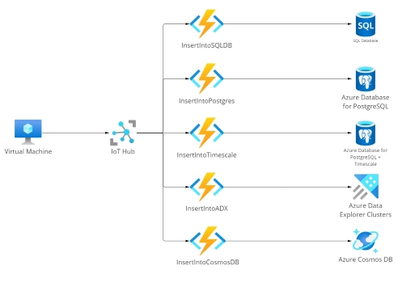

# Introduction
This repo contains code for benchmarking databases offered on Microsoft Azure for time series data.  
Current supported databases:
- Azure SQL DB
- Azure Database for PostgreSQL
- TimescaleDB for Azure Database for PostgreSQL
- Azure Cosmos DB (SQL API)
- Azure Data Explorer

# Overview
The az-ts-bench project provides scripts, functions and instructions, that create resources in Azure, simulate devices and import the data sent from devices into the databases. Note that it is not a Benchmark Suite, but simple tools to allow for simple benchmarking.

# What the Benchmark measures
The project can be used to test the ingress duration and egress duration of the databases. 

# Use Case
Currently, there is no specific hard coded use case. The Python script for the data generation can be adjusted to various needs. It currently is set up to send a timestamp, a value and a deviceId, analogous to IoT use cases.  
Furthermore a best-effort *messages per device per seconds* parameter can be set 

# Benchmark Workflow and Architecture
For the ingress the architecture is as follows: On a virtual machine a Python script is being run, which simulates devices sending IoT telemetry messages. The messages are being sent to an IoT Hub, from there the Azure functions pick the messages up from the respective consumer groups (views on the IoT Hub) and insert the data into the respective databases.
It is important to note, that a __Streaming Ingest__ approach is taken in favor of a __Batch Ingest__ approach. Therefore each Function invocation inserts a single message into the databases.  

 

The egress architecture is also based on Azure Functions. These are HTTP-triggered. In the post body of the message it is possible to specify which query to execute and how many times. These queries are then executed on the database with help of the recommended .NET clients.  
The results of the benchmark are being aggregated and stored into Blob Storage.  

# Background
This project was created as part of my bachelors thesis. 

__Title__: Introduction and Comparison of Time Series Databases  
__University__: [University of Münster](https://www.uni-muenster.de/en/)  
__Group__:  [Practical Computer Science](https://www.wi.uni-muenster.de/department/pi)  
__Degree Course__: Information Systems (B.Sc.)  
__Company__: [ML!PA Consulting GmbH](https://www.ml-pa.com/)  
__Primary supervisor__: [Prof. Dr. Herbert Kuchen](https://www.wi.uni-muenster.de/department/pi/people/herbert-kuchen)  
__Secondary advisor__: [Dr. Benjamin Kettner](https://github.com/benkettner)
